# ShopWave — E-Commerce Web Application

A full-stack e-commerce platform built with Java Spring Boot.

## Tech Stack
- Java 17
- Spring Boot 3.2
- Spring Security 6
- Hibernate / JPA
- MySQL 8
- Thymeleaf
- Maven

## Features
- Role-based authentication (Admin / Customer / Delivery Partner)
- Product and category management
- Shopping cart with size selection for fashion products
- Multi-step checkout with delivery slot selection
- Automated estimated delivery date calculation
- Order tracking with visual progress bar
- Delivery partner portal with exclusive order assignment
- Return and exchange request workflow
- Printable invoice generation
- Admin dashboard with live statistics

## Setup Instructions

### Prerequisites
- Java 17
- MySQL 8
- Maven

### Steps
1. Clone the repository
   git clone https://github.com/YOUR_USERNAME/ShopWave.git

2. Create MySQL database
   CREATE DATABASE shop;

3. Update application.properties with your MySQL credentials

4. Run the application
   mvn spring-boot:run

5. Open browser at http://localhost:8084

## Default Credentials
- Admin: admin@shopwave.com / admin123
- Customer: Register a new account
- Delivery Partner: Register a new account

## Screenshots
## Landing Page
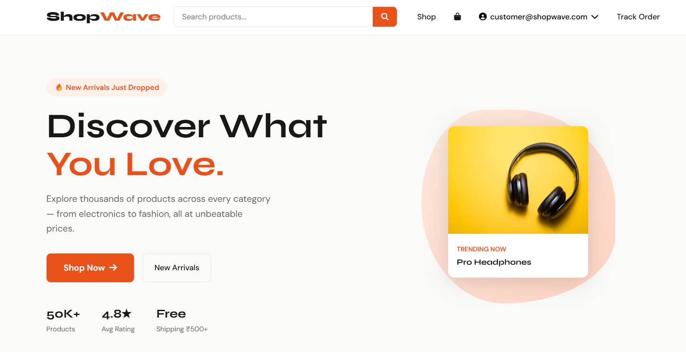

## Customer Login
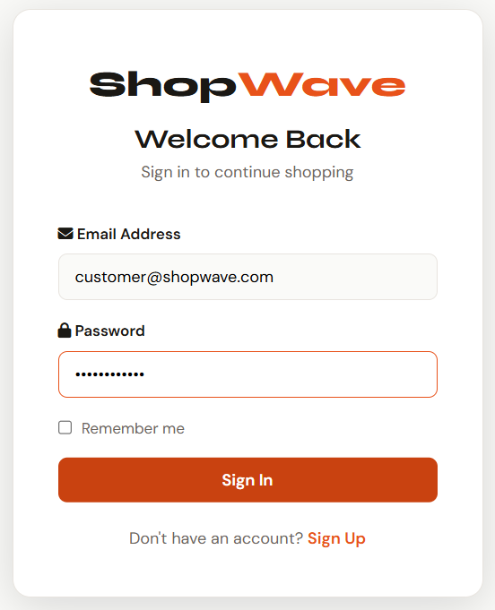

## Home Page
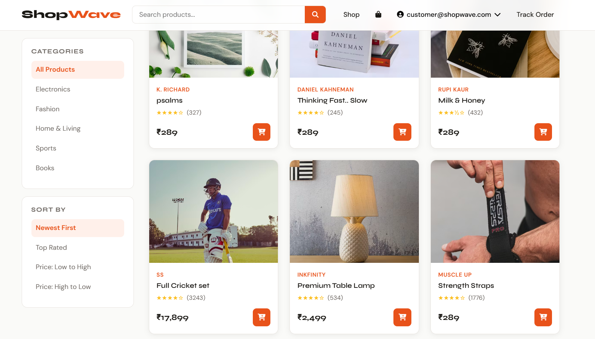

## New Arrivals
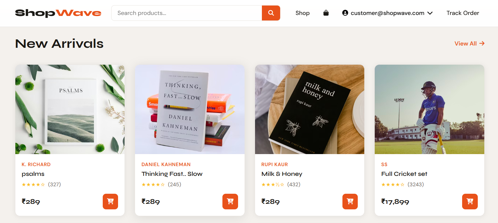

## Product 

## My Cart
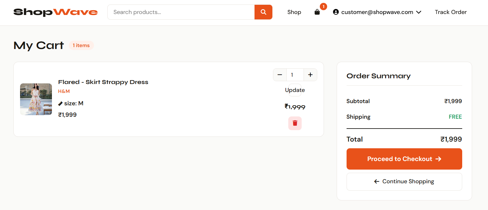

## Delivery Slot
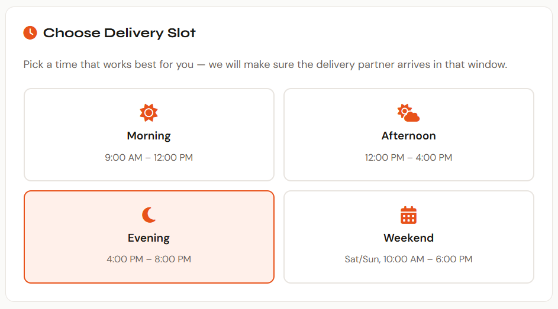

## Payment Methods
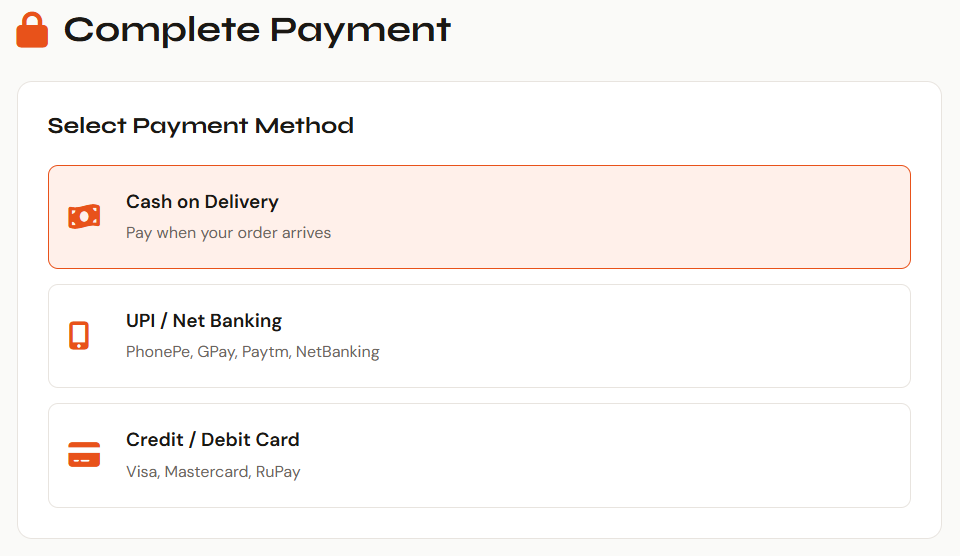

## Checkout
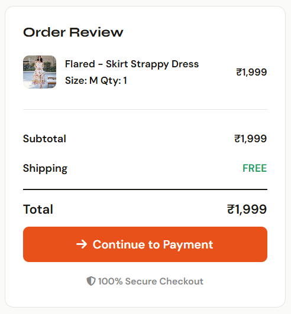

## Bill/Invoice
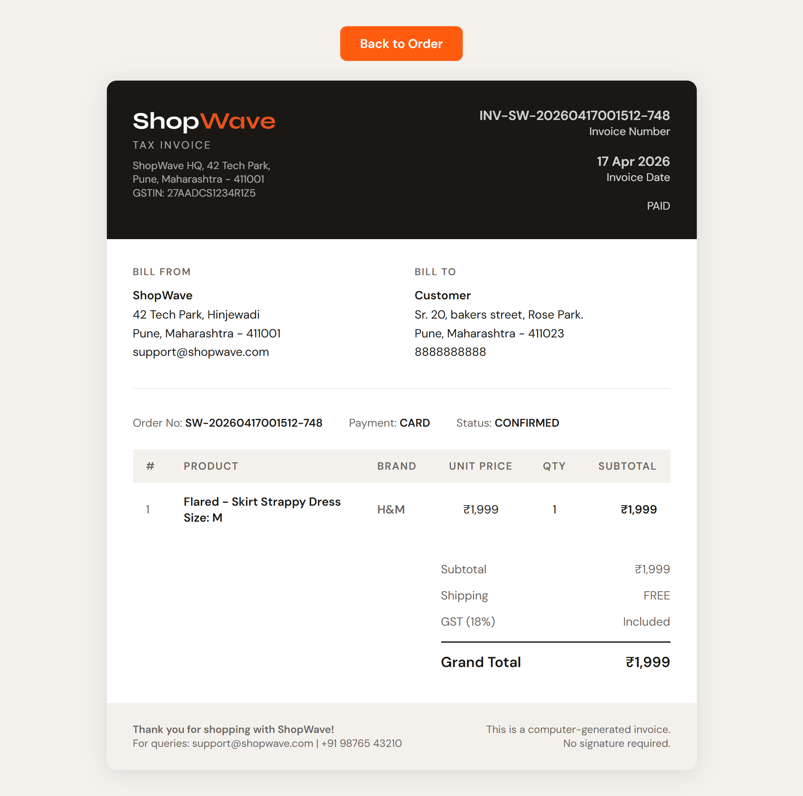

## Track Order
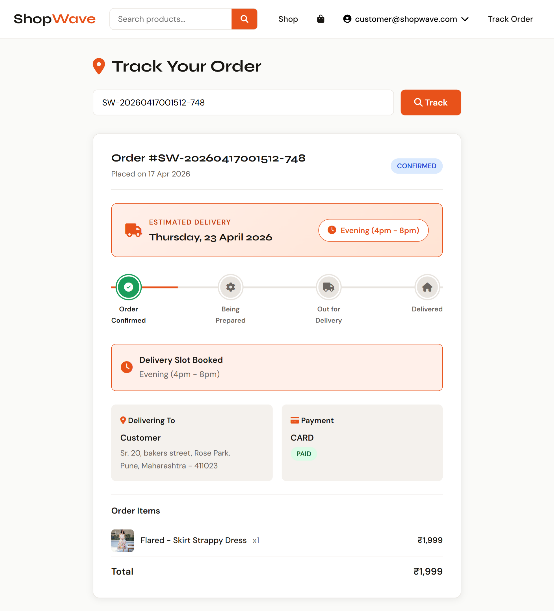

## Admin Login
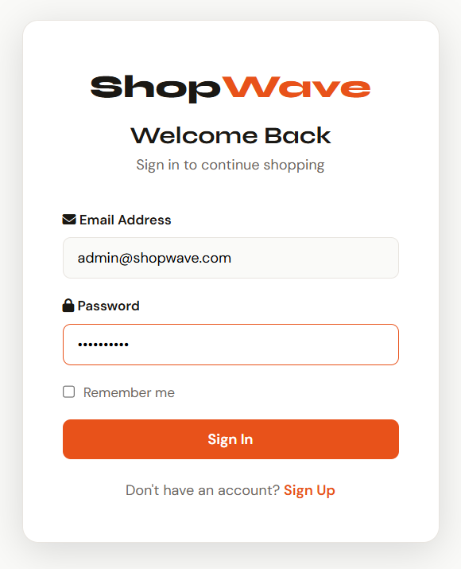

## Admin Dashboard
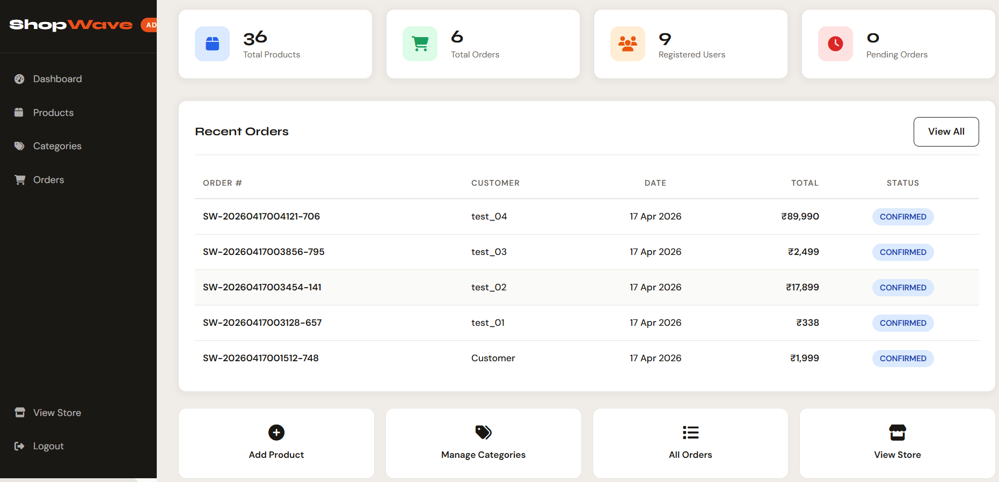

## Category Management
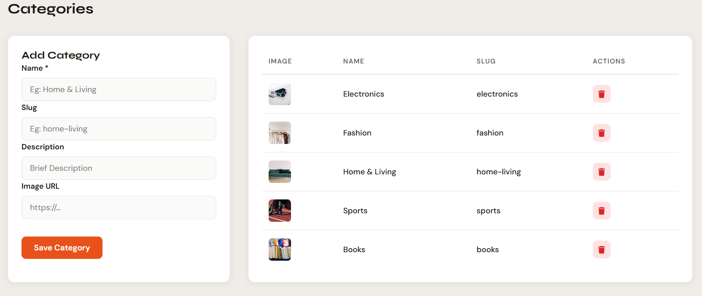

## Product Management
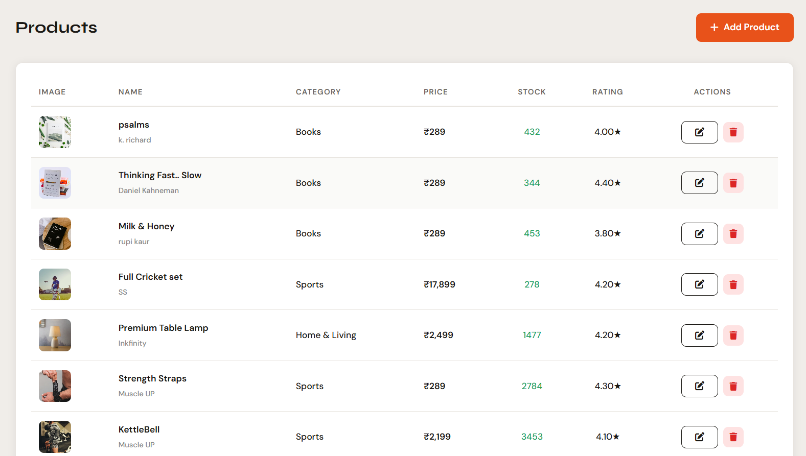

## View Orders
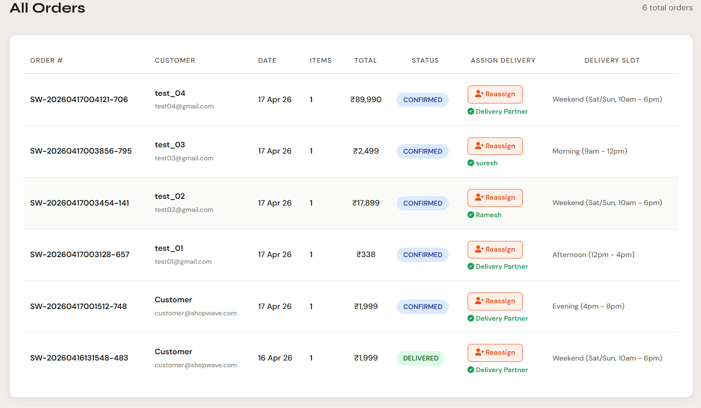

## Assign Delivery
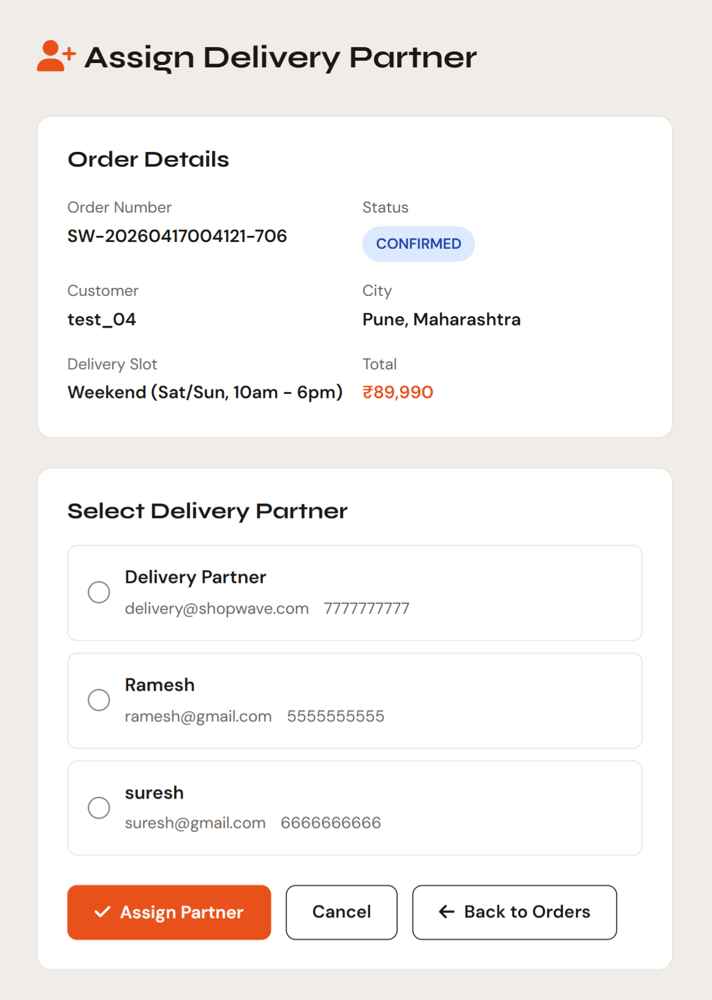

## Delivery Login
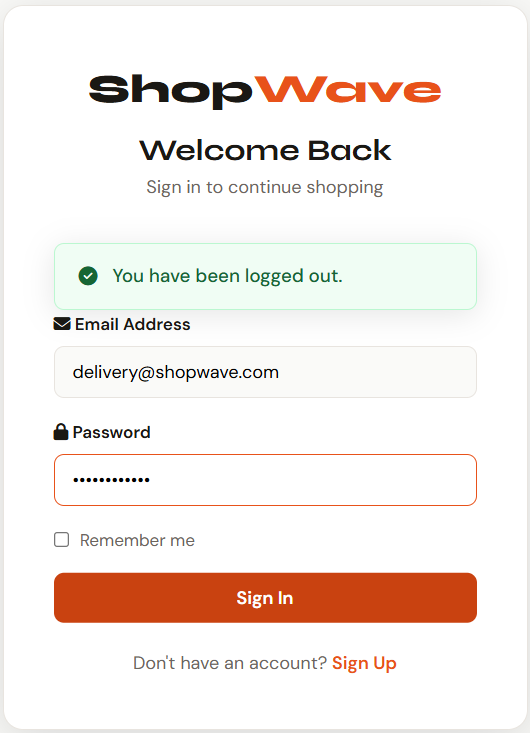

## Delivery Details
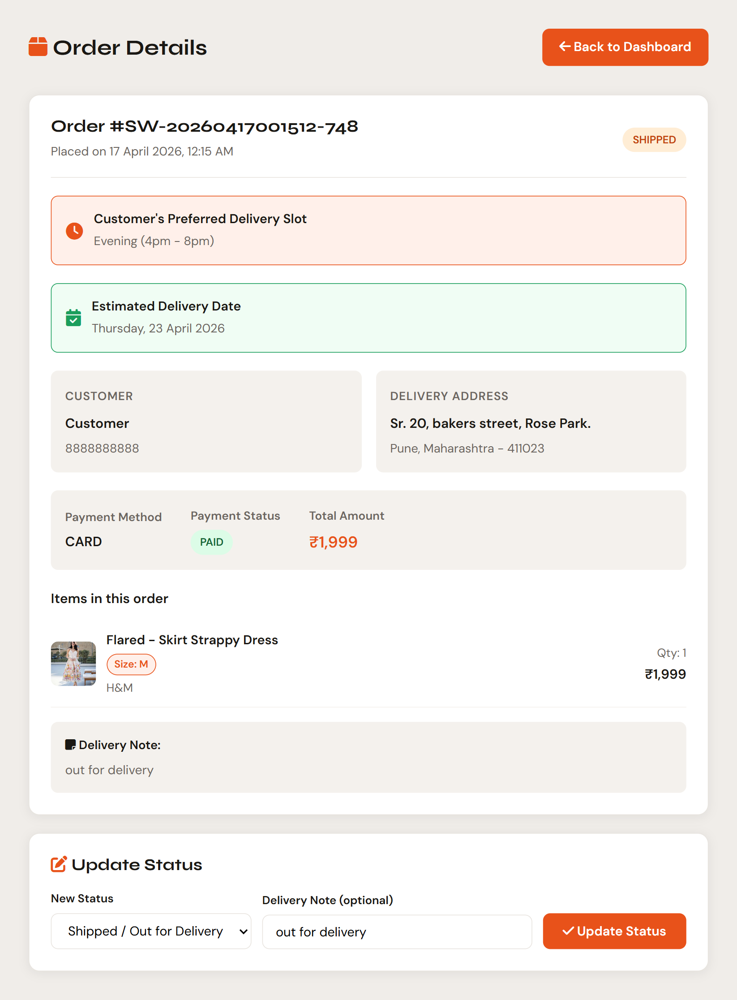
